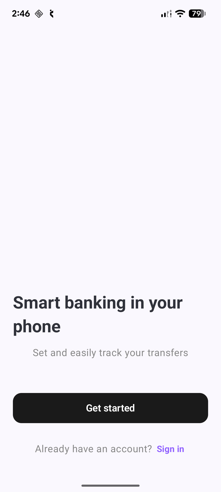
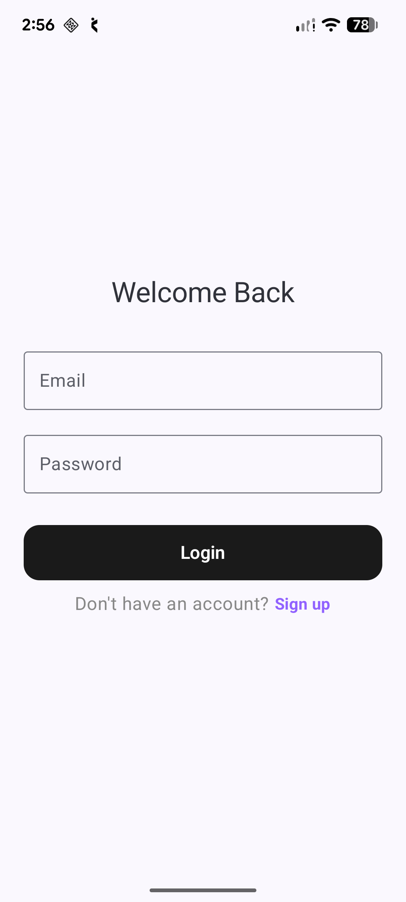
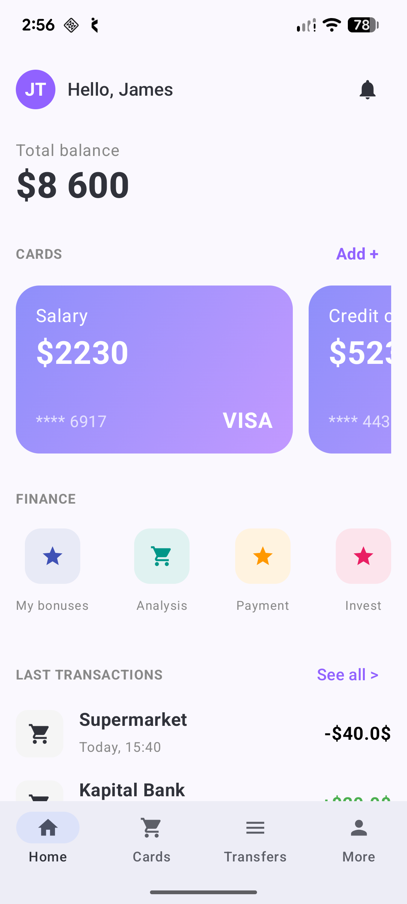

# JetpackFintecApp

JetpackFintecApp is a modern, clean, and secure FinTech application built using **Jetpack Compose** and following **Clean Architecture** principles. The app provides a seamless user experience for managing finances, tracking transactions, and handling bank cards.

## 📱 Features

- **Onboarding:** Smooth introduction to the app's core value proposition.
- **Authentication:** Secure Login and Sign-up screens.
- **Dashboard:** Overview of total balance, active cards, and quick financial actions.
- **Transaction History:** Real-time tracking of recent expenditures.
- **Card Management:** Visual representation of user's bank cards (Visa, etc.).
- **Security:** Implementation of secure storage for sensitive data.

## 🛠 Tech Stack

- **UI:** Jetpack Compose with Material 3.
- **Navigation:** Jetpack Navigation Compose.
- **Architecture:** Clean Architecture (Core, Domain, Presentation).
- **Language:** Kotlin.
- **State Management:** Compose State and ViewModels.

## 📸 Screenshots

| Onboarding | Login | Dashboard |
|---|---|---|
|  |  |  |

## 🏗 Project Structure

- `core/`: Common UI components, security utilities, and base classes.
- `domain/`: Business logic, models, and repository interfaces.
- `presentation/`: Compose screens, ViewModels, and navigation logic.

## 🚀 Getting Started

1. Clone the repository.
2. Open the project in Android Studio (Ladybug or newer recommended).
3. Build and run the app on an emulator or physical device.

---

*Note: Please ensure the screenshots are placed in the `screenshots/` directory at the root of the project.*
